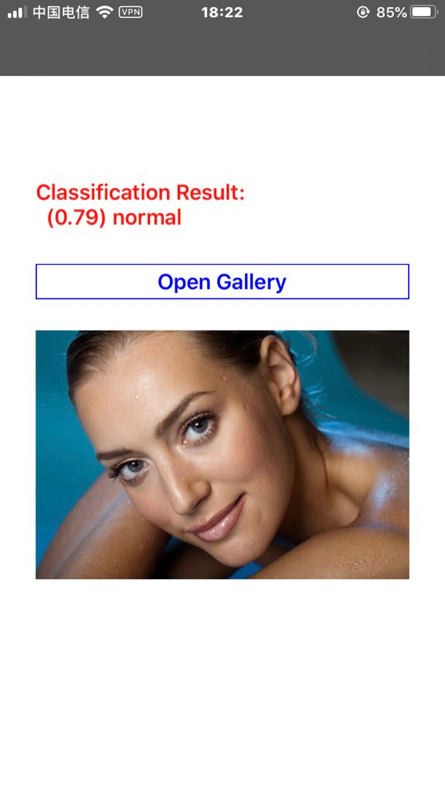
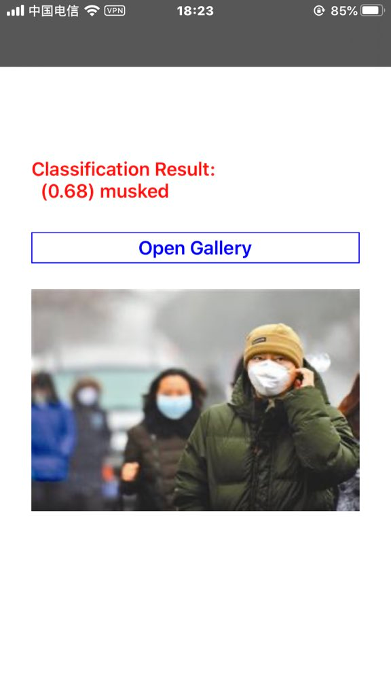

# maskedClassification
A coreML test for machine learning focusing on distinguishing masked faces or not.  

## 1. DataSource for Machine Learning.  
ffmpeg -r 1 -i http://videoName.mov -r 1 "$filename%03d.png"

Record a video maybe 10s or 15s, then extract each key-frames as a picture at every second in [ffmpeg](https://ffmpeg.org/)  
Take the pictures as the datasource for Machine Learning.  

## 2. Trainning, Validating and Testing.  
With the help in Xcode, we can create a client-side lite-coreML if we use [CreateML] in [File]--[Open Developer Tool]

## 3. Export the MLModel for integrating in existed projects CoreML.framework etc. That's awesome but obviously OVERFITTING. 

## 4. Go alittle deeper for ML for adjusting.(To be continue.)

  

  

  